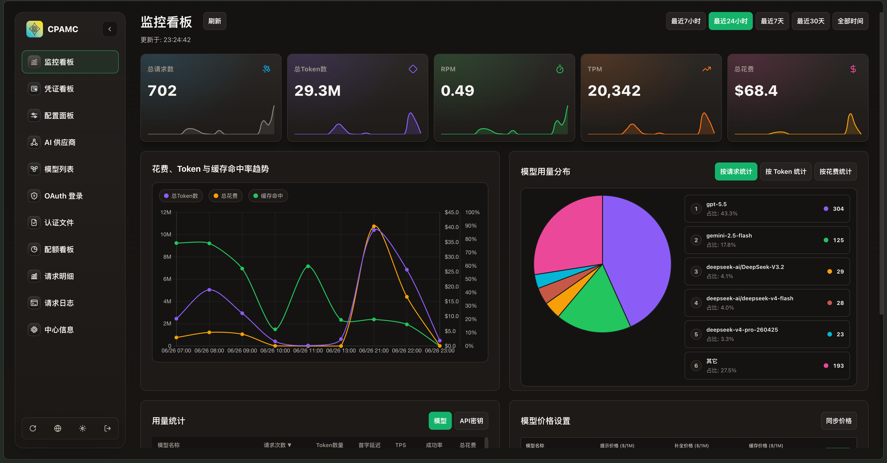
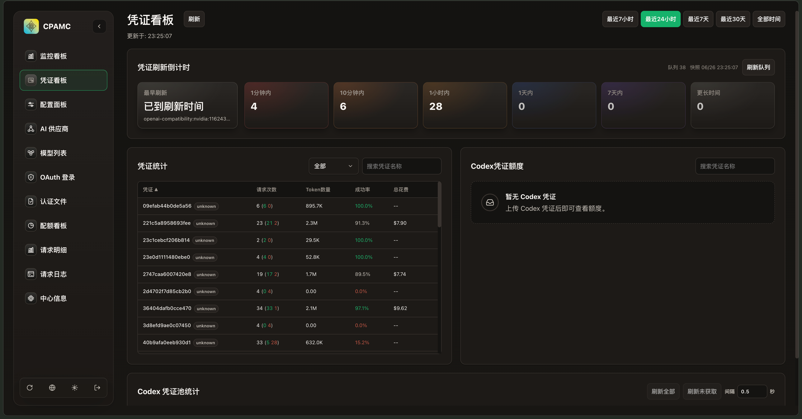
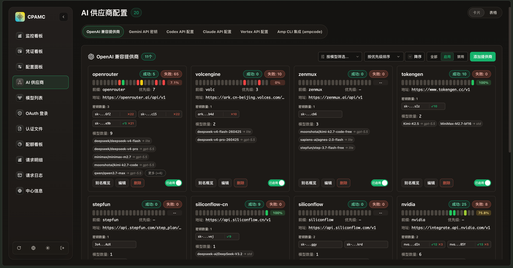
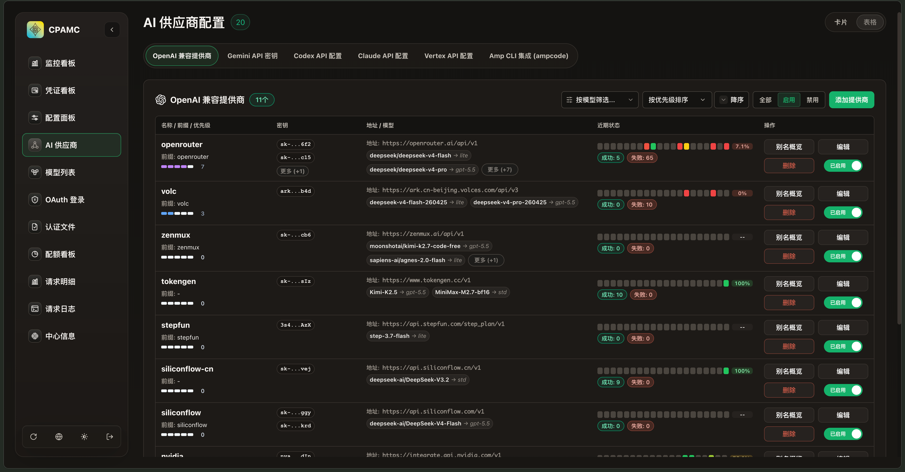
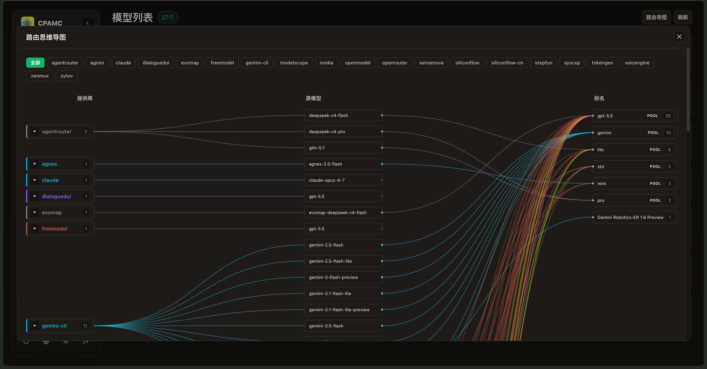
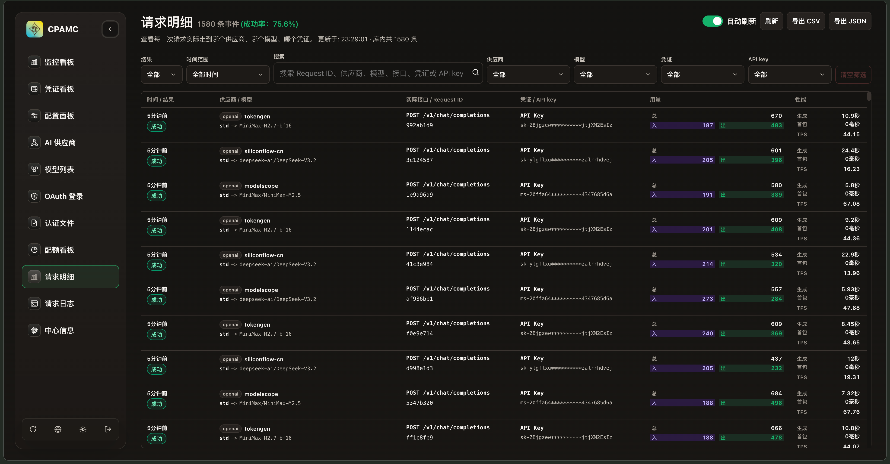
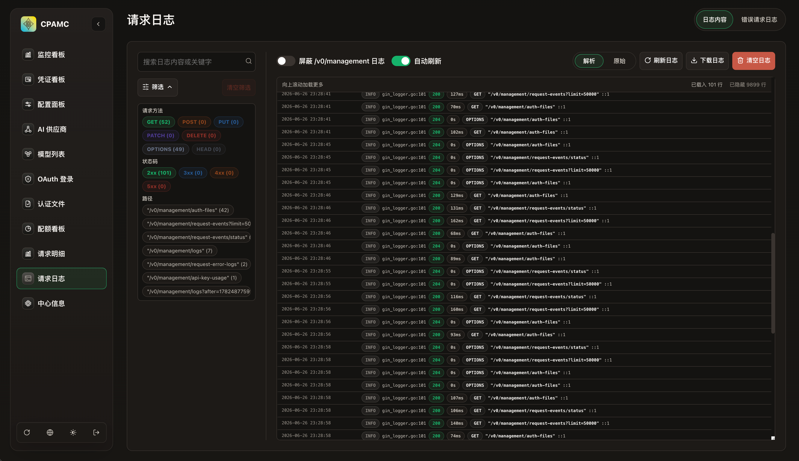
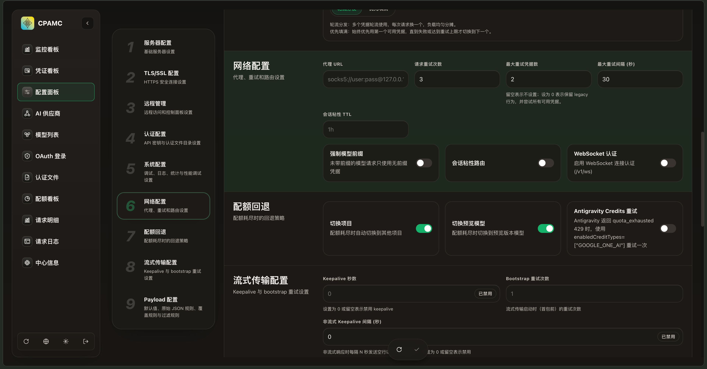

# cpa-web

**cpa-web** 是 [cpa-core](https://github.com/fxzer/cpa-core) 的 Web 管理界面，提供监控中心、凭证管理、用量统计、配置编辑等功能。

构建产物为单文件 `index.html`（所有资源内联），部署到 cpa-core 后端的 static 目录即可使用。

---

## 快速开始

### 开发模式

```bash
# 1. 启动 cpa-core 后端（前提：已配置 config.yaml）
cd /path/to/cpa-core
go run ./cmd/server -config config.yaml

# 2. 另开终端，启动前端开发服务器
cd /path/to/cpa-web
npm install
npm run dev
```

前端 Vite 开发服务器默认运行在 `http://localhost:5173`。

打开浏览器访问该地址，在登录页面输入：

| 字段 | 值 |
|------|-----|
| **API 地址** | `http://localhost:8317`（即 cpa-core 的监听地址） |
| **管理密钥** | cpa-core 配置文件中的 `remote-management.secret-key` |

点击连接即可开始开发调试。

> **为什么不需要配置代理？**
> 前端通过登录页面在**运行时**动态设置 API 地址，存于 localStorage。
> 无论是 Vite 开发服务器还是生产环境的单文件 HTML，都是通过用户填入的 API 地址直接请求 cpa-core，没有编译期配置或 Vite proxy 依赖。

### 构建

```bash
npm run build
```

产物输出到 `dist/index.html`，单文件，无外部依赖。

---

## 部署方式

cpa-web 有两种使用方式：

### 方式一：本地构建部署

从源码构建并部署到 cpa-core 后端：

```bash
npm run build

# 使用 deploy.sh 一键部署到后端 static 目录
./deploy.sh --to ~/cpa-core/static

# 或手动复制
cp dist/index.html ~/cpa-core/static/web.html

# 然后重启 cpa-core 服务
```

### 方式二：使用 GitHub Release 的预构建产物

每次打 `vX.Y.Z` 标签时，CI 会自动构建并发布 `web.html` 到 Releases 页面。
直接下载即可使用，无需安装 Node.js 或构建：

```bash
# 下载最新 Release 的 web.html（约 2.5MB，单文件）
curl -L -o web.html https://github.com/fxzer/cpa-web/releases/latest/download/web.html

# 复制到后端 static 目录
cp web.html ~/cpa-core/static/web.html
```

> **cpa-core 后端内置自动更新机制**
> cpa-core 会定期（每 3 小时）检查 GitHub Releases 是否有新版 `web.html`，
> 发现新版本时自动下载更新，无需手动操作。
> 自动更新源指向：`https://github.com/fxzer/cpa-web/releases/latest/download/web.html`
> 可通过配置 `remote-management.disable-auto-update-panel: true` 关闭。

---

## 架构

```
cpa-web (React SPA)
    │  全部页面 → /v0/management/*
    ▼
cpa-core :8317
    AI 代理 + Management API + SQLite 请求事件
```

| 组件 | 说明 |
|------|------|
| **cpa-core** | AI 代理服务，提供代理转发、管理 API、请求监控持久化 |
| **cpa-web** | 本仓库，构建为 `web.html`，由 cpa-core 托管 |

> 请求监控数据由 cpa-core 内置 SQLite 持久化，无需额外 sidecar。

---

## 功能

- **监控中心** — 请求事件列表、模型定价与费用估算、缓存命中/用量趋势图表
- **凭证中心** — 多 Key 管理、OAuth 流程/状态、Auth Refresh Queue
- **AI 供应商** — Gemini / Codex / Claude / Vertex / OpenAI 兼容 / Ampcode 配置
- **认证文件** — 上传/下载/删除 JSON 凭据、模型别名映射、OAuth 排除模型
- **配额管理** — Claude / Antigravity / Codex / Gemini CLI 等配额上限
- **用量统计** — 聚合用量概览、时间范围筛选
- **配置文件** — 浏览器内编辑 YAML（CodeMirror 高亮）、保存/重载
- **日志** — 增量拉取、搜索过滤、隐藏管理端流量
- **OAuth 登录** — 发起 OAuth/设备码流程、iFlow Cookie 导入
- **系统信息** — 版本、构建信息、快捷链接、模型列表

---

## 界面预览

> 截图位于 `public/screenshot/` 目录（模型别名路由页面除外，按菜单顺序排列）。

### 监控中心



### 凭证中心



### AI 供应商




### 模型别名路由思维导图


### 请求明细



### 日志



### 配置文件



---

## 基于上游的自定义改动

本项目基于 [router-for-me/Cli-Proxy-API-Management-Center](https://github.com/router-for-me/Cli-Proxy-API-Management-Center) fork，主要改动：

### 新增页面与功能

- **监控中心** — 请求事件列表、趋势图表、缓存命中分析、模型定价
- **凭证中心** — 凭据统计、Auth Refresh Queue 监控、Codex 凭证池
- **批量模型测试** — OpenAI / Gemini 批量测试弹窗，复选框选择添加模型，测试结果持久保留
- **OAuth 模型别名映射** — 认证文件层级映射配置 UI
- **API Key 备注** — 支持备注标记
- **路由策略切换** — 可视化配置编辑器中支持路由策略 Pill 切换、用量示例弹窗、禁用筛选标签持久化到 localStorage
- **模型别名路由图** — 模型映射关系的交互式可视化图表

### UI/UX 改进

- **监控首页** — 统计卡片强调色与仪表盘一致，添加缓存命中图表
- **请求监控** — 时间列与状态标签样式统一，凭据行格式化便于扫读
- **请求明细优化** — 相对时间显示，hover 显示绝对时间，表格布局更清晰
- **Provider 编辑页布局统一** — 各供应商编辑页布局顺序一致
- **Provider 状态徽章** — AI 供应商和认证文件页面添加状态徽章
- **页面切换** — 竖向过渡动画
- **配置编辑** — 网格布局优化内边距与过渡，API Key 区块可读性提升
- **响应式** — 移动端适配修复
- **Provider 实时生效** — 配置变更即时反映

### 部署与工程化

- **deploy.sh** — 简化前端部署脚本，`--to <目录>` 直接部署到后端 static 目录
- **单文件构建** — Vite + `vite-plugin-singlefile`，产物 `index.html` 内联所有资源
- **Release CI** — 自动构建并发布 `web.html` 到 GitHub Releases
- **后端自动更新** — cpa-core 自动检测并下载新版 web.html

### 其他

- **语言精简** — 移除 zh-TW、ru，仅保留 en、zh-CN
- **命名规范** — 前后端统一为 cpa-web / cpa-core，管理页面文件统一为 `web.html`
- **Dev 模式** — Vite 开发服务器自动检测 cpa-core 端口，无需手动配置代理

---

## 技术栈

- React 19 + TypeScript 5.9
- Vite 7（单文件构建）
- Zustand（状态管理）
- Axios（HTTP 客户端）
- react-router-dom v7（HashRouter）
- Chart.js（数据可视化）
- CodeMirror 6（YAML 编辑器）
- SCSS Modules（样式）
- i18next（国际化）
- motion（动画）

---

## 开发命令

```bash
npm run dev         # 启动开发服务器
npm run build       # tsc + Vite 构建
npm run preview     # 本地预览 dist
npm run lint        # ESLint
npm run format      # Prettier
npm run type-check  # tsc --noEmit
```

---

## 浏览器兼容性

构建目标 `ES2020`，支持 Chrome、Firefox、Safari、Edge 等现代浏览器。支持移动端响应式布局。
